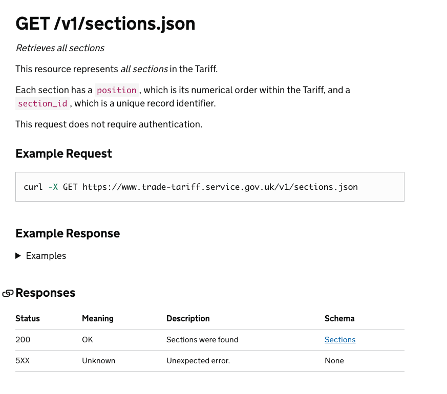

# GOV.UK Tariff API Documentation

This is a microsite for providing documentation for the GOV.UK Tariff API.

This documentation is built from source files in this repository and an
[OpenAPI](https://github.com/OAI/OpenAPI-Specification) specification
[file](/v2/openapi.yaml) for the Tariff API.

The framework for this documentation
is provided by the [GOV.UK Tech Docs Template][tech-docs-template] and through
the use of a [fork][forked-widdershins] of [widdershins][widdershins] to
convert the [`openapi.yaml`][tariff-openapi] to Markdown.

These docs are deployed to the following URLs:

- *Development* - https://api.dev.trade-tariff.service.gov.uk
- *Staging* - https://api.staging.trade-tariff.service.gov.uk
- *Production* - https://api.trade-tariff.service.gov.uk

## Updating content

To update content of this site, modify the files under `source` directory, i.e., `source/v2/openapi.yaml`.

HTML pages are in the [`/source`][source-dir] of this repository and are authored using Markdown. You can make edits to these pages by making changes in a branch and then opening a pull request.

The [`/reference.html`](https://api.trade-tariff.service.gov.uk/#gov-uk-trade-tariff-api) page is built using the `source/v2/openapi.yaml` file, which is an [OAS 3.0](https://github.com/OAI/OpenAPI-Specification/blob/master/versions/3.0.0.md) document that describes the Trade Tariff API and is used to build the HTML documentation website.

The OpenAPI Specification (OAS) defines a standard, language-agnostic interface to RESTful APIs which allows both humans and computers to discover and understand the capabilities of the service without access to source code, documentation, or through network traffic inspection. When properly defined, a consumer can understand and interact with the remote service with a minimal amount of implementation logic.

### Updating the API Documentation

To update the Trade Tariff API documentation, you may follow this general workflow:

- If the changes involve the content of the HTML pages ( `/index` and `/getting_started`), edit the corresponding `.md` or `.md.erb` template under `source/*`.

  - edit `source/index.html.md.erb` or `source/getting-started.html.md`
  - open or view [http://localhost:4567](http://localhost:4567) in a browser, the browser should automatically reload the page after changes are saved

- If the changes involve the API specification itself, edit the `source/v2/openapi.yaml` file. This file is used to build the HTML file `build/reference.html`.

  - edit `source/v2/openapi.yaml`

  - ```shell
    make serve
    ```

  - manually (re)load [http://localhost:4567](http://localhost:4567) in a browser when the Middleman server (re)starts

- It is also useful to add an entry in the `NEWS.yml` file, this information will be published on the Latest News page for users viewing these docs. It will also be added to the `/feed.xml` atom feed for anyone subscribing for updates.

### Support for multiple API versions

As we release new versions of the API, we will continue to support older versions (until they're deprecated). Therefore, we should continue to publish that version's API reference and the corresponding `openapi.yaml` file.

In order to do this, some modifications to the default Middleman templates and options are required:

1. create a new `openapi.yaml` file for the new API version and a directory in which to store it

```
mkdir v2
touch v2/openapi.yaml
```

2. edit `config/tech-docs.yml` - add new link in the header for old reference file, i.e.;

```
 Reference: /reference.html
```

3. edit `Makefile`

- add new task to generate old reference file
- rename previous reference file, add "-v1" (or whatever the old version number is) to the output filename

  ```
  ./generate.js source/v1/openapi.yaml source/reference-v1.html.md.erb
  ```

### Editing the `openapi.yaml` file

An OpenAPI document that conforms to the OpenAPI Specification is itself a JSON object, which may be represented either in JSON or YAML format. For this project, we are using the YAML format.

#### Example from `openapi.yaml`

```yaml
paths:
  /api/v2/sections:
    get:
      summary: Retrieves all sections
      description: |
        This resource represents _all sections_ in the Tariff.

        Each section has a `position`, which is its numerical order within the Tariff, and a `section_id`, which is a unique record identifier.

      tags:
        - Sections
      produces:
        - application/json
      responses:
        200:
          description: Sections were found
          content:
            application/json:
              schema:
                $ref: "#/components/schemas/Sections"
              example:
                $ref: "#/components/schemas/Sections/example"
        5XX:
          description: Unexpected error.
      x-code-samples:
        /api/api/v2/sections:
          lang: shell
          source: |-
            curl -X GET https://www.trade-tariff.service.gov.uk/api/v2/sections
```

The example above is rendered into HTML:



### Use of [`$ref`](https://swagger.io/specification/#documentStructure)

The `openapi.yaml` file makes use of [`$ref`](https://swagger.io/specification/#documentStructure) to refer to connected parts of the specification. In the example above, [`$ref`](https://swagger.io/specification/#documentStructure) is used to refer to the schema and example response in another part of the document.

Information on `$ref`: <https://swagger.io/specification/#documentStructure>

### Links

- OAS 3.0 Specification (<https://github.com/OAI/OpenAPI-Specification/blob/master/versions/3.0.0.md#oasDocument>)
- Swagger, upon which OAS is based (<https://swagger.io/specification/>)

## Running documentation locally

### Pre Requisite

Graphviz installed in your local environment

### Manual Build and Deploy

Manual build and deploy is not necessary if automated deploy is used.

1. Build the documentation

```
bundle exec middleman build --clean
```

2. Push to prod

```
cf push tariff-api-production
```

### Installing dependencies

Setting up the documentation requires Ruby and Node. Run the following to install the necessary dependencies:

```
make requirements
```

**Note:** You will also need to manually install Graphviz via your package manager

### Preview changes

Whilst writing documentation we can run a middleman server to preview how the
published version will look in the browser. After saving a change the preview in
the browser will automatically refresh on HTML pages. However for changes to
[`openapi.yaml`][tariff-openapi] you will need to restart the preview.

Type the following to start the server:

```
make serve
```

You should now be able to view a live preview at <http://localhost:4567>.

## Publishing documentation

### Development

Any changes pushed to GitHub on a branch (eg, a Pull Request) will be deployed
automatically to the [Development URL](https://tariff-api-dev.london.cloudapps.digital)

### Production

Any changes to `main` on GitHub will be deployed automatically to our published docs
at [api.trade-tariff.service.gov.uk](https://api.trade-tariff.service.gov.uk)

## License

[MIT License](LICENSE)

[forked-widdershins]: https://github.com/alphagov/widdershins
[widdershins]: https://github.com/Mermade/widdershins
[tariff-openapi]: https://github.com/trade-tariff/trade-tariff-api-docs/tree/main/source/v2/openapi.yaml
[source-dir]: https://github.com/trade-tariff/trade-tariff-api-docs/tree/main/source
[tech-docs-template]: https://github.com/alphagov/tech-docs-template
